# QA Retest Report (Cycle 2) — TasteLanka Restaurant Review Portal

| | |
|---|---|
| Product / version | Commit `eed62c2` "bug fixes" (branch dev) — cycle 1 tested `fc1f1cc` |
| Cycle | Cycle 2 — defect retest and full regression, 1 October 2026 |
| Baseline | Test Plan (BB-01…BB-20, DR-01…DR-07, UT-01…UT-10) and the cycle 1 regression suites |
| Prepared by | Manuja Rajakaruna — every result from actual execution; evidence under `testing/cycles/cycle 2/evidence/` |

## 1. Executive Summary
All twenty cycle-1 defects were retested on commit `eed62c2` and the complete cycle-1 regression pack was re-executed, together with new tests for the changed behaviour. **20 of 20 cycle-1 defects pass their retest and are Closed**. One new defect was found: **DEF-021 (Medium)** — the backend test suite as committed does not compile, so `./mvnw test`/`package` fail at this commit (fixed locally by QA, needs to be committed).

Counted tests: **296** — **284 passed, 1 failed, 10 not executed** (usability sessions, no participants), **1 not applicable**. Pass rate = passed ÷ (passed + failed) = **99.6%** (cycle 1: 62.8%). Baseline: **20/20 BB pass** (BB-19 is a partial pass – interface language switching is not implemented; cycle 1: 16/20); **7/7 dry runs pass**. Regression: **0 test(s) changed from PASS to FAIL**; 91 changed from FAIL to PASS.

Remaining failures are: C2-AUTO-001.

## 2. Scope of Cycle 2
* **Retest** of DEF-001…DEF-020 against their original expected results.
* **Regression** — re-execution of every cycle-1 suite: backend JUnit (existing + QA), Python API/security/data harness (151 original API tests), persistence across restart, moderator scope, performance, Playwright UI/E2E (BB, DR, responsive, accessibility, multilingual).
* **New behaviour introduced by the fix commit** — tested with new cases: API: TC-API-030…035 (price/spice filters), TC-API-040…046 (problem+json error bodies), TC-MOD-015…021 (rejection reason, audit fields, re-moderation, rating aggregation), TC-REV-021…027 (review deletion and its access rules), TC-ADM-038/039; start-up: TC-SEC-007/008; JUnit: TC-UNIT-JWT-006, TC-UNIT-DOM-006, TC-INT-023…026, TC-INT-042.
* Out of scope (unchanged): FR-11/FR-12 (not implemented), usability sessions (no participants), load testing.

## 3. Test Environment
Same machine and tools as cycle 1 (Windows 11 10.0.26200, JDK 17.0.12, Maven 3.9.16, Node 22.21.0, MySQL 8.0.45 on port 3307, Edge 154 via Playwright 1.63.0, axe-core 4.13.0, Python 3.9.12). Differences:
* Commit under test `eed62c2`. The working tree also contained an **uncommitted local change to `application.yml`** (datasource defaults → localhost:3307 root/root); it was overridden by `DB_URL`/`DB_USERNAME`/`DB_PASSWORD` in every run and does not affect results.
* Fresh schemas **`tastelanka_qa_c2`** and **`tastelanka_junit_c2`** created from the *updated* `database/schema/001_schema.sql` (price-range CHECK, `moderated_by`/`moderated_at`) and the seed script.
* Per the updated README a **private `JWT_SECRET`** (64 random URL-safe characters, test value in `testing/qa.env`) was set for the API.
* All cycle-2 outputs written to `testing/cycles/cycle 2/` (scripts now require `QA_OUT`, so cycle 1 evidence cannot be overwritten).

## 4. Approach and Test Maintenance
Each defect's retest uses the tests that failed in cycle 1 plus targeted new tests; the whole cycle-1 pack is then re-run as regression. Where the fix commit **intentionally** changed the UI or an API signature, the affected tests were updated (never to hide a product failure). The UI suite was first run **unchanged** (run 1: 25 passed, 39 failed — evidence `evidence/ui/C2-UI-run1-unchanged-specs-*`), then with the maintained specs (final run: 63 passed, 1 failed).

| Where | Change | Reason |
|---|---|---|
| helpers.ts, customer.spec.ts | Password fields located by role name (/^Password/, /^Confirm password/) instead of getByLabel('Password') | Show/Hide toggle added to password fields; the old locator matched two elements (36 of 39 run-1 failures) |
| admin.spec.ts BB-13, dry-runs.spec.ts DR-06 | Enter a moderation note before Reject; BB-13 also asserts the 'Add a reason' guard first | Rejection reason is now mandatory (DEF-020 fix) |
| admin.spec.ts TC-ADM-UI-002 | Assert a clear refusal message without the impossible 'remove reviews first' instruction | Retest against DEF-007's expected result ('409 with a workable instruction'); the cycle-1 proxy check for review-delete buttons no longer reflects the fix design |
| customer.spec.ts TC-UI-013 | Click the Vegan chip as a link; check every Galle result is in Galle | Chips became links; cycle-1 assertion assumed one Galle cafe, but QA data adds 'QA Reviewed Cafe' in Galle |
| customer.spec.ts TC-UI-006 | After the selector check, choose a restaurant and complete the submission | Retest of DEF-014 – the journey can now be completed |
| nonfunctional.spec.ts BB-18c | Open the collapsible 'Filters' panel before counting controls | Mobile filters now live in a <details> disclosure |
| DomainModelTest (JUnit) | Call Review.moderate(status, note, moderator) and assert moderator/time | Production signature changed; committed test no longer compiled (DEF-021) |
| RequestValidationTest TC-UNIT-VAL-010 (JUnit) | Disabled with reason; result recorded as NOT APPLICABLE | Premise (Bean Validation on the request record) obsolete – fix validates in the controller + DB constraint; behaviour verified by TC-INT-034, TC-ADM-007, TC-ADM-039 |

## 5. Test Execution Summary
| Level/Type | Total | Passed | Failed | Not executed | Not applicable | Cycle 1 (pass/fail) |
|---|---|---|---|---|---|---|
| API/Security/Data (system) | 183 | 183 | 0 | 0 | 0 | 82/70 |
| JUnit integration | 29 | 29 | 0 | 0 | 0 | 13/11 |
| JUnit unit | 24 | 23 | 0 | 0 | 1 | 21/1 |
| Baseline black-box (UI/E2E) | 20 | 20 | 0 | 0 | 0 | 16/4 |
| Dry run (E2E) | 7 | 7 | 0 | 0 | 0 | 7/0 |
| Performance (UI) | 1 | 1 | 0 | 0 | 0 | 1/0 |
| UI/E2E | 18 | 18 | 0 | 0 | 0 | 12/6 |
| Existing automated/static | 4 | 3 | 1 | 0 | 0 | 3/0 |
| Usability (participant) | 10 | 0 | 0 | 10 | 0 | 0/0 |

Not counted: 26 setup steps and 4 informational observations (TC-SEC-006, TC-SEC-060, TC-SEC-071/072). Static checks: ESLint, `next build` and `tsc` pass; `./mvnw test` as committed fails to compile (C2-AUTO-001, DEF-021); after the test update the backend suite runs 76 tests: 75 passed, 1 not applicable (C2-AUTO-002, final run C2-AUTO-003: BUILD SUCCESS).

## 6. Defect Retest Results
| Defect | Sev. | Title | Retest result | Status now |
|---|---|---|---|---|
| DEF-001 | High | API returns HTTP 403 with empty body instead of the real error status (400/401/404/405/409 | PASS | Closed |
| DEF-002 | Medium | Unauthenticated requests to protected endpoints return 403 instead of 401 | PASS | Closed |
| DEF-003 | Critical | Default JWT signing secret committed in application.yml allows forging admin tokens | PASS | Closed |
| DEF-004 | Medium | Approved reviews never update restaurant/dish rating or review count | PASS | Closed |
| DEF-005 | Low | Restaurant accepted with minimum price greater than maximum price | PASS | Closed |
| DEF-006 | Medium | Updating a restaurant or dish to an existing slug causes an unhandled server exception | PASS | Closed |
| DEF-007 | Medium | Restaurants that have reviews cannot be deleted; UI instructs an impossible action | PASS | Closed |
| DEF-008 | High | Admin edits to seeded data are overwritten, and deleted seeded dishes are re-created, on e | PASS | Closed |
| DEF-009 | Medium | Cuisine category links do not filter the restaurant list | PASS | Closed |
| DEF-010 | Medium | Price and spice-level filters are not available; home page filter chips and location selec | PASS | Closed |
| DEF-011 | Low | 'Clear all' unticks filters but results stay filtered until 'Apply Filters' is pressed | PASS | Closed |
| DEF-012 | Medium | No search filters available on mobile | PASS | Closed |
| DEF-013 | Medium | Restaurant listing overflows horizontally and collapses at tablet width (768 px) | PASS | Closed |
| DEF-014 | Medium | 'Write a Review' from the home page is a dead end (no restaurant can be selected) | PASS | Closed |
| DEF-015 | Low | Restaurant page shows 'Save' for a restaurant the user has already saved | PASS | Closed |
| DEF-016 | Low | Home page 'Top Rated' cards and cuisine counts are hard-coded and disagree with live data | PASS | Closed |
| DEF-017 | Medium | Insufficient colour contrast of brand-orange text (WCAG 1.4.3) | PASS | Closed |
| DEF-018 | Medium | Search input and select boxes on /restaurants have no accessible label | PASS | Closed |
| DEF-019 | Medium | Rating star buttons are announced only as '★' with no value or selected state | PASS | Closed |
| DEF-020 | Medium | Moderation actions are not traceable (no moderator, timestamp or reason captured) | PASS | Closed |
| DEF-021 | Medium | Backend test suite does not compile at commit eed62c2 (DomainModelTest uses the old Review | PASS (pending commit) | Fixed |

Per-defect retest test IDs, statuses and evidence: `retest-results.csv`. The live register `testing/defects/defect-register.csv` has been updated (Status, Fix Version, Retest Result); the pre-retest copy is `defect-register-before-retest.csv`.

## 7. Regression Results
Comparison of every counted test with its cycle-1 status (`regression-comparison.csv`): FAIL→PASS: 91, unchanged PASS: 155, new: 39, other: 11.
**No test that passed in cycle 1 fails in cycle 2.**

## 8. Functional (Baseline) Results
| Test ID | Requirement | Cycle 1 | Cycle 2 | Defect |
|---|---|---|---|---|
| BB-01 | FR-06 | PASS | PASS |  |
| BB-02 | FR-06, FR-17 | PASS | PASS |  |
| BB-03 | FR-07 | PASS | PASS |  |
| BB-04 | FR-07 | PASS | PASS |  |
| BB-05 | FR-08 | PASS | PASS |  |
| BB-06 | FR-01 | PASS | PASS |  |
| BB-07 | FR-04 | PASS | PASS |  |
| BB-08 | FR-05 | FAIL | PASS |  |
| BB-09 | FR-02, FR-03 | PASS | PASS |  |
| BB-10 | FR-09 | PASS | PASS |  |
| BB-11 | FR-09, FR-17 | PASS | PASS |  |
| BB-12 | FR-10 | PASS | PASS |  |
| BB-13 | FR-14 | PASS | PASS |  |
| BB-14 | FR-16 | PASS | PASS |  |
| BB-15 | FR-13 | PASS | PASS |  |
| BB-16 | FR-13 | PASS | PASS |  |
| BB-17 | FR-18 | FAIL | PASS |  |
| BB-18 | NFR-04 | FAIL | PASS |  |
| BB-19 | FR-15 | PASS (partial – UI translation not implemented) | PASS (partial – UI translation not implemented) |  |
| BB-20 | NFR-03 | FAIL | PASS |  |

## 9. Dry Runs
| Test ID | Cycle 1 | Cycle 2 | Notes |
|---|---|---|---|
| DR-01 | PASS | PASS | Completed – see step log |
| DR-02 | PASS | PASS | Completed – see step log |
| DR-03 | PASS | PASS | Completed – see step log |
| DR-04 | PASS | PASS | Completed – see step log |
| DR-05 | PASS | PASS | Completed – see step log |
| DR-06 | PASS | PASS | Completed – see step log |
| DR-07 | PASS | PASS | Completed – see step log |

## 10. API and Security Results
* Original API/security suite: 152 passed / 0 failed (cycle 1: 82 / 70).
* Errors now return the correct status with an RFC 7807 `application/problem+json` body (e.g. 400 `fullName: must not be blank`, 409 `Restaurant has customer reviews and cannot be deleted`); unauthenticated requests get 401.
* Token forged with the old default secret: **PASS** (rejected). API start-up without `JWT_SECRET`: **PASS**; with the `.env.example` placeholder: **PASS**.
* Review deletion: author only (another customer 403, admin token 403, anonymous 401, missing 404); deleting an approved review updates the rating.
* Observations unchanged from cycle 1 (not defects): no login throttling after 10 failures (TC-SEC-060); a JWT stays valid until expiry after logout (TC-SEC-006); MODERATOR can create/delete restaurants (TC-SEC-071/072).

## 11. Non-Functional Results
**Performance (NFR-01)** — measured only (no thresholds defined):

| ID | Operation | Cycle 1 median ms | Cycle 2 median ms | Cycle 1 p95 | Cycle 2 p95 |
|---|---|---|---|---|---|
| PERF-001 | Restaurant listing | 10.8 | 13.1 | 13.2 | 16.1 |
| PERF-002 | Search q=crab | 9.6 | 10.5 | 10.8 | 11.9 |
| PERF-003 | Filter location=Kandy&vegan=true | 8.7 | 9.7 | 9.7 | 11.7 |
| PERF-004 | Top-rated | 8.6 | 9.0 | 10.0 | 11.2 |
| PERF-005 | Restaurant details | 8.1 | 8.8 | 10.3 | 10.8 |
| PERF-006 | Restaurant menu (dishes) | 9.5 | 10.8 | 11.3 | 11.7 |
| PERF-007 | Public approved reviews | 10.3 | 12.0 | 11.9 | 14.9 |
| PERF-008 | Own reviews (auth) | 12.0 | 13.4 | 13.6 | 14.8 |
| PERF-009 | Profile (auth) | 8.9 | 10.8 | 10.5 | 11.9 |
| PERF-010 | Login (bcrypt) | 96.6 | 103.9 | 99.4 | 110.2 |
| PERF-011 | Submit review (auth, write) | 15.9 | 22.0 | 22.0 | 23.1 |

Median change per operation: +0.4 to +7.3 ms (single client, local; indicative). The listing query now also evaluates the spice-level sub-query.

**Responsiveness** — mobile PASS, tablet PASS (cycle 1 FAIL, 153 px overflow), desktop PASS; mobile filters PASS.
**Accessibility** — axe WCAG 2.1 A/AA PASS; star buttons PASS; form labels PASS; keyboard login PASS; focus PASS. Observation: the password input's accessible name is now "Password Show password" because the new toggle button sits inside the label (minor; not logged as a defect).
**Multilingual** — Sinhala/Tamil content PASS/PASS; UI language switch FAIL (not implemented – change-management item, as in cycle 1).

## 12. New Defects and Observations
* **DEF-021 (Medium / High priority)** — backend test sources do not compile at `eed62c2`; QA updated `DomainModelTest` in the working tree (uncommitted). Status *Fixed*, to be closed once committed and the build passes on the committed code.
* Observation — seeded restaurants keep their demo rating/review counts and approved reviews are added on top (e.g. Ministry of Crab 320 → 322); expected for demo seed data, but the seeded numbers are not real reviews.
* Observation — password-field accessible name (see §11).
* Observation — at 768 px (tablet portrait) the header logo text "TasteLanka" touches the "Home" link (no overflow; cosmetic, also visible in cycle 1) — see the cycle-2 tablet figure in Appendix A.3.

## 13. Requirements Traceability (summary)
| Requirement | Purpose | Execution Status | Result | Coverage Status |
|---|---|---|---|---|
| FR-01 | Restaurant browsing | 5/5 executed | PASS | Covered |
| FR-02 | Restaurant details | 4/4 executed | PASS | Covered |
| FR-03 | Menu/dish information | 4/4 executed | PASS | Covered |
| FR-04 | Restaurant search | 7/7 executed | PASS | Covered |
| FR-05 | Restaurant filtering | 10/10 executed | PASS | Covered |
| FR-06 | User registration | 9/9 executed | PASS | Covered |
| FR-07 | User authentication | 7/7 executed | PASS | Covered |
| FR-08 | User profile | 5/5 executed | PASS | Covered |
| FR-09 | Ratings and reviews | 9/9 executed | PASS | Covered |
| FR-10 | Own review management/viewing | 6/6 executed | PASS | Covered |
| FR-11 | Review comments | — | — | Not Implemented |
| FR-12 | Restaurant responses | — | — | Not Implemented |
| FR-13 | Restaurant/menu management | 11/11 executed | PASS | Covered |
| FR-14 | Review moderation | 7/7 executed | PASS | Covered |
| FR-15 | Multilingual content | 6/6 executed | PASS | Partially Covered |
| FR-16 | Role-based access | 9/9 executed | PASS | Covered |
| FR-17 | Validation/error handling | 8/8 executed | PASS | Covered |
| FR-18 | Data persistence | 7/7 executed | PASS | Covered |
| NFR-01 | Performance of common actions | Executed (PERF-001..011, PERF-UI) | MEASURED | Partially Covered |
| NFR-02 | Usability | 0/10 executed | NOT EXECUTED | Not Evidenced |
| NFR-03 | Accessibility | 1/1 executed | PASS | Covered |
| NFR-04 | Responsiveness | 1/1 executed | PASS | Covered |
| NFR-05 | Security/access control | 11/11 executed | PASS | Covered |
| NFR-06 | Privacy/data handling | 6/6 executed | PASS | Covered |
| NFR-07 | Data integrity | 5/5 executed | PASS | Covered |
| NFR-08 | Error handling/reliability | 7/7 executed | PASS | Covered |
| NFR-12 | Testability | Assessed | FAIL | Partially Covered |
| NFR-13 | Administrative/moderation traceability | 5/5 executed | PASS | Covered |

Full matrix (test IDs, evidence, defects): `traceability-matrix.csv`.

## 14. Test Metrics
See `test-metrics.md`. Retest pass rate: **21/21** defects (100.0%). Defects: Fixed 1, Closed 20; open by severity: Medium 1.

## 15. Evidence Index
355 cycle-2 evidence items catalogued as C2-EVID-001…C2-EVID-355 in `evidence-index.csv`. Appendix A shows the key before/after evidence; cycle-1 items keep their cycle-1 IDs (EVID-nnn, `testing/cycles/cycle 1/evidence-index.csv`).

## 16. Outstanding Risks / Issues
* DEF-021 must be committed, otherwise CI and packaging fail on the dev branch.
* No reopened defects.
* Not implemented: FR-11 review comments, FR-12 restaurant responses, interface language switching (FR-15 partial).
* Unchanged observations: no login throttling, JWT not revocable on logout, MODERATOR has full catalogue rights.
* Usability (NFR-02) still unevidenced — UT-01…UT-10 need participants.
* `testing/qa.env` holds local test credentials and the test JWT secret and is tracked by git; keep it out of shared repositories.

## 17. Final QA Assessment
Based on executed tests, the fix commit resolves the defects listed as Closed above, including the Critical token-forgery issue (DEF-003) and both High defects (DEF-001, DEF-008), and introduced no regression in previously passing tests. Before the build can be accepted, DEF-021 must be committed (the committed code does not pass `./mvnw test`). FR-11, FR-12 and UI translation remain not implemented, and usability testing with participants is still outstanding.

## Appendix A — Retest Evidence (before / after)
Cycle 1 items are from `testing/cycles/evidence/` (IDs EVID-nnn); cycle 2 items from `testing/cycles/cycle 2/evidence/` (IDs C2-EVID-nnn). Screenshots are downscaled copies; very tall pages are cropped to the top.

### A.1 API and security (same test, cycle 1 vs cycle 2)

#### DEF-001 — TC-AUTH-003

**Cycle 1 · EVID-062 · TC-AUTH-003** — Register with empty body (missing all fields) · verdict **FAIL**

```
POST http://localhost:8080/api/v1/auth/register
Authorization: none
Request body: {}
→ HTTP 403  Content-Type: -
Response body: (empty)
Expected: HTTP 400 with validation feedback
Actual:   HTTP 403
```

**Cycle 2 · C2-EVID-075 · TC-AUTH-003** — Register with empty body (missing all fields) · verdict **PASS**

```
POST http://localhost:8080/api/v1/auth/register
Authorization: none
Request body: {}
→ HTTP 400  Content-Type: application/problem+json
Response body: {"detail": "email: must not be blank", "instance": "/api/v1/auth/register", "status": 400, "title": "Bad Request"}
Expected: HTTP 400 with validation feedback
Actual:   HTTP 400
```

#### DEF-001 — TC-ADM-003

**Cycle 1 · EVID-005 · TC-ADM-003** — Create restaurant with duplicate slug · verdict **FAIL**

```
POST http://localhost:8080/api/v1/admin/restaurants
Authorization: Bearer <ADMIN token>
Request body: {"slug": "qa-rest-190512", "name": "QA Test Bistro", "cuisine": "Sri Lankan · Fusion", "location": "Galle", "priceMin": 1000, "priceMax": 2500, "vegetarian": true, "vegan": false, "halal": true, "description": "Created b …(truncated)
→ HTTP 403  Content-Type: -
Response body: (empty)
Expected: HTTP 409
Actual:   HTTP 403
```

**Cycle 2 · C2-EVID-005 · TC-ADM-003** — Create restaurant with duplicate slug · verdict **PASS**

```
POST http://localhost:8080/api/v1/admin/restaurants
Authorization: Bearer <ADMIN token>
Request body: {"slug": "qa-rest-112400", "name": "QA Test Bistro", "cuisine": "Sri Lankan · Fusion", "location": "Galle", "priceMin": 1000, "priceMax": 2500, "vegetarian": true, "vegan": false, "halal": true, "description": "Created b …(truncated)
→ HTTP 409  Content-Type: application/problem+json
Response body: {"detail": "Restaurant slug already exists", "instance": "/api/v1/admin/restaurants", "status": 409, "title": "Conflict"}
Expected: HTTP 409
Actual:   HTTP 409
```

#### DEF-002 — TC-SEC-001

**Cycle 1 · EVID-203 · TC-SEC-001** — Protected endpoint without token (/users/me) · verdict **FAIL**

```
GET http://localhost:8080/api/v1/users/me
Authorization: none
→ HTTP 403  Content-Type: -
Response body: (empty)
Expected: HTTP 401 Unauthorized
Actual:   HTTP 403
```

**Cycle 2 · C2-EVID-237 · TC-SEC-001** — Protected endpoint without token (/users/me) · verdict **PASS**

```
GET http://localhost:8080/api/v1/users/me
Authorization: none
→ HTTP 401  Content-Type: application/problem+json;charset=ISO-8859-1
Response body: {"status": 401, "detail": "Authentication is required"}
Expected: HTTP 401 Unauthorized
Actual:   HTTP 401
```

#### DEF-003 — TC-SEC-005

**Cycle 1 · EVID-207 · TC-SEC-005** — Forged admin token signed with default JWT secret (JWT_SECRET not set, as in README run steps) · verdict **FAIL**

```
GET http://localhost:8080/api/v1/admin/dashboard
Authorization: Bearer <token forged offline with the default JWT secret from application.yml>
→ HTTP 200  Content-Type: application/json
Response body: {"restaurants": 7, "dishes": 4, "users": 8, "pendingReviews": 3, "approvedReviews": 4}
Expected: HTTP 401/403 – tokens not issued by the server must be rejected
Actual:   HTTP 200
```

**Cycle 2 · C2-EVID-241 · TC-SEC-005** — Forged admin token signed with default JWT secret (JWT_SECRET not set, as in README run steps) · verdict **PASS**

```
GET http://localhost:8080/api/v1/admin/dashboard
Authorization: Bearer <token forged offline with the default JWT secret from application.yml>
→ HTTP 401  Content-Type: application/problem+json;charset=ISO-8859-1
Response body: {"status": 401, "detail": "Authentication is required"}
Expected: HTTP 401/403 – tokens not issued by the server must be rejected
Actual:   HTTP 401
```

#### DEF-004 — TC-MOD-012

**Cycle 1 · EVID-090 · TC-MOD-012** — Approved review is reflected in restaurant reviewCount/rating · verdict **FAIL**

```
GET http://localhost:8080/api/v1/restaurants/ministry-of-crab
Authorization: none
→ HTTP 200  Content-Type: application/json
Response body: {"id": 1, "slug": "ministry-of-crab", "name": "Ministry of Crab", "cuisine": "Seafood · Sri Lankan", "location": "Colombo", "rating": 4.8, "reviewCount": 320, "priceMin": 8000, "priceMax": 12000, "vegetarian": false, "vegan": false, "halal": true, "description": "Popular seafood dining in Colombo. B …(truncated)
Expected: HTTP 200; reviewCount increases by 1 and rating is recalculated after approval
Actual:   HTTP 200; reviewCount before=320 after=320; rating before=4.8 after=4.8
```

**Cycle 2 · C2-EVID-113 · TC-MOD-012** — Approved review is reflected in restaurant reviewCount/rating · verdict **PASS**

```
GET http://localhost:8080/api/v1/restaurants/ministry-of-crab
Authorization: none
→ HTTP 200  Content-Type: application/json
Response body: {"id": 1, "slug": "ministry-of-crab", "name": "Ministry of Crab", "cuisine": "Seafood · Sri Lankan", "location": "Colombo", "rating": 4.8, "reviewCount": 321, "priceMin": 8000, "priceMax": 12000, "vegetarian": false, "vegan": false, "halal": true, "description": "Popular seafood dining in Colombo. B …(truncated)
Expected: HTTP 200; reviewCount increases by 1 and rating is recalculated after approval
Actual:   HTTP 200; reviewCount before=320 after=321; rating before=4.8 after=4.8
```

#### DEF-005 — TC-ADM-007

**Cycle 1 · EVID-009 · TC-ADM-007** — Create restaurant with priceMin > priceMax · verdict **FAIL**

```
POST http://localhost:8080/api/v1/admin/restaurants
Authorization: Bearer <ADMIN token>
Request body: {"slug": "qa-inverted-190512", "name": "QA Test Bistro", "cuisine": "Sri Lankan · Fusion", "location": "Galle", "priceMin": 9000, "priceMax": 100, "vegetarian": true, "vegan": false, "halal": true, "description": "Create …(truncated)
→ HTTP 201  Content-Type: application/json
Response body: {"id": 7, "slug": "qa-inverted-190512", "name": "QA Test Bistro", "cuisine": "Sri Lankan · Fusion", "location": "Galle", "rating": 0, "reviewCount": 0, "priceMin": 9000, "priceMax": 100, "vegetarian": true, "vegan": false, "halal": true, "description": "Created by QA API test.", "imageColor": "#1234 …(truncated)
Expected: HTTP 400 (minimum price must not exceed maximum price)
Actual:   HTTP 201
```

**Cycle 2 · C2-EVID-009 · TC-ADM-007** — Create restaurant with priceMin > priceMax · verdict **PASS**

```
POST http://localhost:8080/api/v1/admin/restaurants
Authorization: Bearer <ADMIN token>
Request body: {"slug": "qa-inverted-112400", "name": "QA Test Bistro", "cuisine": "Sri Lankan · Fusion", "location": "Galle", "priceMin": 9000, "priceMax": 100, "vegetarian": true, "vegan": false, "halal": true, "description": "Create …(truncated)
→ HTTP 400  Content-Type: application/problem+json
Response body: {"detail": "Minimum price must not exceed maximum price", "instance": "/api/v1/admin/restaurants", "status": 400, "title": "Bad Request"}
Expected: HTTP 400 (minimum price must not exceed maximum price)
Actual:   HTTP 400
```

#### DEF-006 — TC-ADM-011

**Cycle 1 · EVID-013 · TC-ADM-011** — Update restaurant to slug already used by another restaurant · verdict **FAIL**

```
PUT http://localhost:8080/api/v1/admin/restaurants/6
Authorization: Bearer <ADMIN token>
Request body: {"slug": "nuga-gama", "name": "QA Test Bistro", "cuisine": "Sri Lankan · Fusion", "location": "Galle", "priceMin": 1000, "priceMax": 2500, "vegetarian": true, "vegan": false, "halal": true, "description": "Created by QA  …(truncated)
→ HTTP 403  Content-Type: -
Response body: (empty)
Expected: HTTP 409 Conflict (slug already exists)
Actual:   HTTP 403
```

**Cycle 2 · C2-EVID-013 · TC-ADM-011** — Update restaurant to slug already used by another restaurant · verdict **PASS**

```
PUT http://localhost:8080/api/v1/admin/restaurants/6
Authorization: Bearer <ADMIN token>
Request body: {"slug": "nuga-gama", "name": "QA Test Bistro", "cuisine": "Sri Lankan · Fusion", "location": "Galle", "priceMin": 1000, "priceMax": 2500, "vegetarian": true, "vegan": false, "halal": true, "description": "Created by QA  …(truncated)
→ HTTP 409  Content-Type: application/problem+json
Response body: {"detail": "Restaurant slug already exists", "instance": "/api/v1/admin/restaurants/6", "status": 409, "title": "Conflict"}
Expected: HTTP 409 Conflict (slug already exists)
Actual:   HTTP 409
```

#### DEF-007 — TC-ADM-037

**Cycle 1 · EVID-036 · TC-ADM-037** — Delete restaurant that has customer reviews · verdict **FAIL**

```
DELETE http://localhost:8080/api/v1/admin/restaurants/8
Authorization: Bearer <ADMIN token>
→ HTTP 403  Content-Type: -
Response body: (empty)
Expected: HTTP 204 (restaurant and dependent data removed) or HTTP 409 with an explanatory message; never a 5xx
Actual:   HTTP 403
```

**Cycle 2 · C2-EVID-036 · TC-ADM-037** — Delete restaurant that has customer reviews · verdict **PASS**

```
DELETE http://localhost:8080/api/v1/admin/restaurants/7
Authorization: Bearer <ADMIN token>
→ HTTP 409  Content-Type: application/problem+json
Response body: {"detail": "Restaurant has customer reviews and cannot be deleted", "instance": "/api/v1/admin/restaurants/7", "status": 409, "title": "Conflict"}
Expected: HTTP 204 (restaurant and dependent data removed) or HTTP 409 with an explanatory message; never a 5xx
Actual:   HTTP 409
```

#### DEF-008 — TC-DATA-002

**Cycle 1 · EVID-154 · TC-DATA-002** — Admin edit to seeded restaurant survives restart · verdict **FAIL**

```
GET http://localhost:8080/api/v1/restaurants/nuga-gama
Authorization: none
→ HTTP 200  Content-Type: application/json
Response body: {"id": 4, "slug": "nuga-gama", "name": "Nuga Gama", "cuisine": "Sri Lankan · Authentic", "location": "Colombo", "rating": 4.4, "reviewCount": 150, "priceMin": 3000, "priceMax": 5000, "vegetarian": true, "vegan": true, "halal": true, "description": "Traditional Sri Lankan dining with local cuisine op …(truncated)
Expected: HTTP 200; description='QA-EDITED description 190512', priceMin=3500
Actual:   HTTP 200; description after restart='Traditional Sri Lankan dining with local cuisine options.'; priceMin=3000
```

**Cycle 2 · C2-EVID-187 · TC-DATA-002** — Admin edit to seeded restaurant survives restart · verdict **PASS**

```
GET http://localhost:8080/api/v1/restaurants/nuga-gama
Authorization: none
→ HTTP 200  Content-Type: application/json
Response body: {"id": 4, "slug": "nuga-gama", "name": "Nuga Gama", "cuisine": "Sri Lankan · Authentic", "location": "Colombo", "rating": 4.4, "reviewCount": 152, "priceMin": 3500, "priceMax": 5000, "vegetarian": true, "vegan": true, "halal": true, "description": "QA-EDITED description 112400", "imageColor": "#662e …(truncated)
Expected: HTTP 200; description='QA-EDITED description 112400', priceMin=3500
Actual:   HTTP 200; description after restart='QA-EDITED description 112400'; priceMin=3500
```

### A.2 New tests for the fixes

**Cycle 2 · C2-EVID-062 · TC-API-030** — Filter maxPrice=2000 returns only restaurants starting at or below LKR 2,000 · verdict **PASS**

```
GET http://localhost:8080/api/v1/restaurants?maxPrice=2000
Authorization: none
→ HTTP 200  Content-Type: application/json
Response body: [{"id": 2, "slug": "the-empire-cafe", "name": "The Empire Cafe", "cuisine": "Cafe · International", "location": "Kandy", "rating": 4.6, "reviewCount": 220, "priceMin": 2000, "priceMax": 4000, "vegetarian": true, "vegan": true, "halal": true, "description": "Casual dining with local and international …(truncated)
Expected: HTTP 200
Actual:   HTTP 200; slugs=['green-leaf-kitchen', 'qa-rest2-112400', 'the-empire-cafe']
```

**Cycle 2 · C2-EVID-063 · TC-API-031** — Filter spiceLevel=Hot returns restaurants with a Hot dish · verdict **PASS**

```
GET http://localhost:8080/api/v1/restaurants?spiceLevel=Hot
Authorization: none
→ HTTP 200  Content-Type: application/json
Response body: [{"id": 1, "slug": "ministry-of-crab", "name": "Ministry of Crab", "cuisine": "Seafood · Sri Lankan", "location": "Colombo", "rating": 4.8, "reviewCount": 322, "priceMin": 8000, "priceMax": 12000, "vegetarian": false, "vegan": false, "halal": true, "description": "Popular seafood dining in Colombo.  …(truncated)
Expected: HTTP 200
Actual:   HTTP 200; slugs=['ministry-of-crab']
```

**Cycle 2 · C2-EVID-118 · TC-MOD-015** — Reject without a reason is refused · verdict **PASS**

```
PATCH http://localhost:8080/api/v1/admin/reviews/9
Authorization: Bearer <ADMIN token>
Request body: {"status": "REJECTED"}
→ HTTP 400  Content-Type: application/problem+json
Response body: {"detail": "A rejection reason is required", "instance": "/api/v1/admin/reviews/9", "status": 400, "title": "Bad Request"}
Expected: HTTP 400
Actual:   HTTP 400; Content-Type=application/problem+json; detail='A rejection reason is required'
```

**Cycle 2 · C2-EVID-121 · TC-MOD-018** — Reject with reason records moderator, time and note · verdict **PASS**

```
PATCH http://localhost:8080/api/v1/admin/reviews/9
Authorization: Bearer <ADMIN token>
Request body: {"status": "REJECTED", "note": "Duplicate content"}
→ HTTP 200  Content-Type: application/json
Response body: {"id": 9, "author": "QA User A", "restaurantSlug": "nuga-gama", "restaurantName": "Nuga Gama", "foodRating": 4, "serviceRating": 4, "overallRating": 4, "language": "en", "reviewText": "Cycle 2 QA review for retest.", "status": "REJECTED", "moderatorNote": "Duplicate content", "moderatedBy": "TasteLa …(truncated)
Expected: HTTP 200
Actual:   HTTP 200; note='Duplicate content' moderatedBy='TasteLanka Admin' moderatedAt='2026-10-01T05:54:19.562502900Z'
```

**Cycle 2 · C2-EVID-124 · TC-MOD-021** — Rejecting a previously approved review removes it from the rating · verdict **PASS**

```
GET http://localhost:8080/api/v1/restaurants/qa-agg-112400c2
Authorization: none
→ HTTP 200  Content-Type: application/json
Response body: {"id": 8, "slug": "qa-agg-112400c2", "name": "QA Aggregation Cafe", "cuisine": "Sri Lankan", "location": "Kandy", "rating": 4.0, "reviewCount": 1, "priceMin": 500, "priceMax": 900, "vegetarian": true, "vegan": false, "halal": false, "imageColor": "#332417"}
Expected: HTTP 200
Actual:   HTTP 200; rating=4.0 count=1
```

**Cycle 2 · C2-EVID-143 · TC-REV-021** — Author deletes own approved review · verdict **PASS**

```
DELETE http://localhost:8080/api/v1/reviews/10
Authorization: Bearer <USER_B token>
→ HTTP 204  Content-Type: -
Response body: (empty)
Expected: HTTP 204
Actual:   HTTP 204
```

**Cycle 2 · C2-EVID-233 · TC-REV-022** — Another user cannot delete someone else's review · verdict **PASS**

```
DELETE http://localhost:8080/api/v1/reviews/10
Authorization: Bearer <USER_A token>
→ HTTP 403  Content-Type: application/problem+json
Response body: {"detail": "You can only delete your own reviews", "instance": "/api/v1/reviews/10", "status": 403, "title": "Forbidden"}
Expected: HTTP 403
Actual:   HTTP 403; Content-Type=application/problem+json; detail='You can only delete your own reviews'
```

**Cycle 2 · C2-EVID-068 · TC-API-040** — Invalid registration returns 400 with problem detail · verdict **PASS**

```
POST http://localhost:8080/api/v1/auth/register
Authorization: none
Request body: {}
→ HTTP 400  Content-Type: application/problem+json
Response body: {"detail": "fullName: must not be blank", "instance": "/api/v1/auth/register", "status": 400, "title": "Bad Request"}
Expected: HTTP 400, Content-Type application/problem+json, non-empty 'detail'
Actual:   HTTP 400; Content-Type=application/problem+json; detail='fullName: must not be blank'
```

**C2-EVID-243 · TC-SEC-007 — API start-up without JWT_SECRET (DEF-003)**

```
Caused by: org.springframework.util.PlaceholderResolutionException: Could not resolve placeholder 'JWT_SECRET' in value "${JWT_SECRET}" <-- "${app.jwt.secret}"
[INFO] BUILD FAILURE
exit=1
```

**C2-EVID-244 · TC-SEC-008 — start-up with the .env.example placeholder (DEF-003)**

```
Caused by: java.lang.IllegalStateException: JWT_SECRET must be set to a private value of at least 32 bytes
[INFO] BUILD FAILURE
exit=1
```

**C2-EVID-155 · C2-AUTO-001 — ./mvnw test as committed (DEF-021)**

```
[ERROR] COMPILATION ERROR :
[ERROR] /D:/restaurent/restaurant-review-portal/backend/src/test/java/com/tastelanka/portal/qa/DomainModelTest.java:[60,15] method moderate in class com.tastelanka.portal.review.Review cannot be appli
[INFO] BUILD FAILURE
[ERROR] /D:/restaurent/restaurant-review-portal/backend/src/test/java/com/tastelanka/portal/qa/DomainModelTest.java:[60,15] method moderate in class com.tastelanka.portal.review.Review cannot be appli
exit=1 elapsed=34s
```

**C2-EVID-156 · C2-AUTO-002 — backend suite after test update**

```
[INFO] Tests run: 1, Failures: 0, Errors: 0, Skipped: 0, Time elapsed: 15.30 s -- in com.tastelanka.portal.BackendApplicationTests
[INFO] Tests run: 23, Failures: 0, Errors: 0, Skipped: 0, Time elapsed: 8.146 s -- in com.tastelanka.portal.qa.ApiIntegrationTest
[INFO] Tests run: 6, Failures: 0, Errors: 0, Skipped: 0, Time elapsed: 0.013 s -- in com.tastelanka.portal.qa.DomainModelTest
[INFO] Tests run: 5, Failures: 0, Errors: 0, Skipped: 0, Time elapsed: 2.311 s -- in com.tastelanka.portal.qa.HttpErrorContractTest
[INFO] Tests run: 6, Failures: 0, Errors: 0, Skipped: 0, Time elapsed: 0.032 s -- in com.tastelanka.portal.qa.JwtServiceTest
[ERROR] Tests run: 35, Failures: 1, Errors: 0, Skipped: 0, Time elapsed: 0.287 s <<< FAILURE! -- in com.tastelanka.portal.qa.RequestValidationTest
[ERROR] Tests run: 76, Failures: 1, Errors: 0, Skipped: 0
```

**EVID-166 · Cycle 1 — database after API restart (DEF-008: edit reverted, deleted dish re-created)**

```
| snapshot_time       |
|  4 | nuga-gama          |      3000 | Traditional Sri Lankan dining with local cuis |
| 10 | seafood-kottu        |             1 |
```

**C2-EVID-199 · Cycle 2 — database after API restart (edit kept, deleted dish stays deleted)**

```
| snapshot_time       |
|  4 | nuga-gama          |      3500 | QA-EDITED description 112400                  |
```

**C2-EVID-198 · Cycle 2 — integrity and moderation-audit checks (DEF-005, DEF-020)**

```
| reviews without user                           | 0 |
| reviews without restaurant                     | 0 |
| reviews whose dish belongs to other restaurant | 0 |
| dishes without restaurant                      | 0 |
| saved rows without user/restaurant             | 0 |
| duplicate saved rows                           | 0 |
| ratings outside 1-5                            | 0 |
| restaurants priceMin>priceMax                  | 0 |
| moderated reviews missing moderator/time       | 0 |
| rejected reviews without reason                | 0 |
| id | status   | moderator_note     | moderated_by             | moderated_at               |
|  6 | REJECTED | QA rejected        | qa.admin@tastelanka.test | 2026-10-01 05:54:03.586565 |
|  9 | REJECTED | Duplicate content  | qa.admin@tastelanka.test | 2026-10-01 05:54:19.562503 |
| 11 | REJECTED | Re-moderated by QA | qa.admin@tastelanka.test | 2026-10-01 05:54:19.797333 |
| ministry-of-crab   |    4.8 |          322 |                      2 |
| the-empire-cafe    |    4.6 |          220 |                      0 |
```

### A.3 UI (cycle 1 vs cycle 2)

#### DEF-009 — cuisine link Seafood

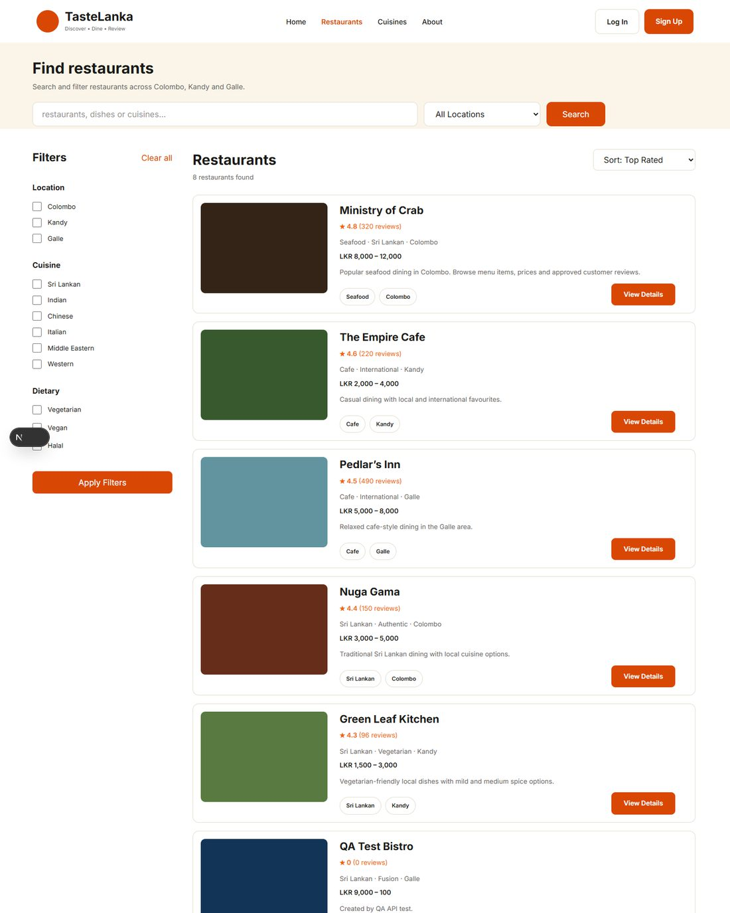

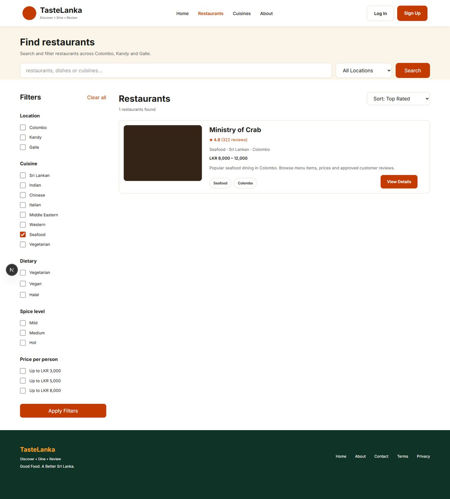

#### DEF-014 — review from the home page

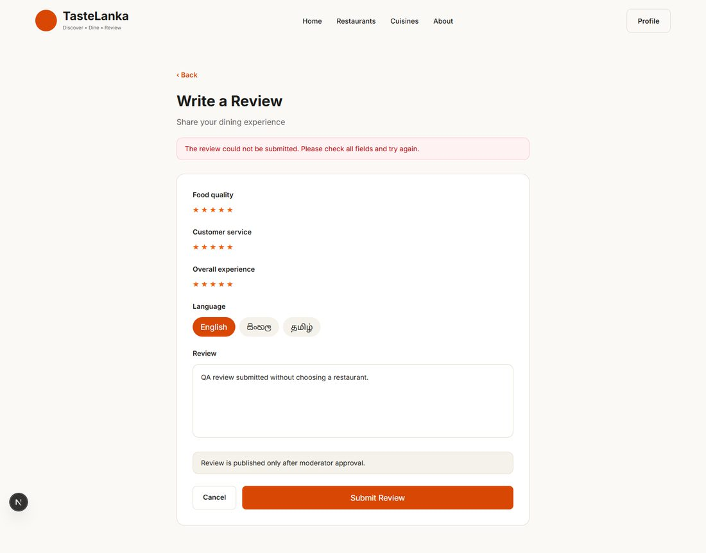

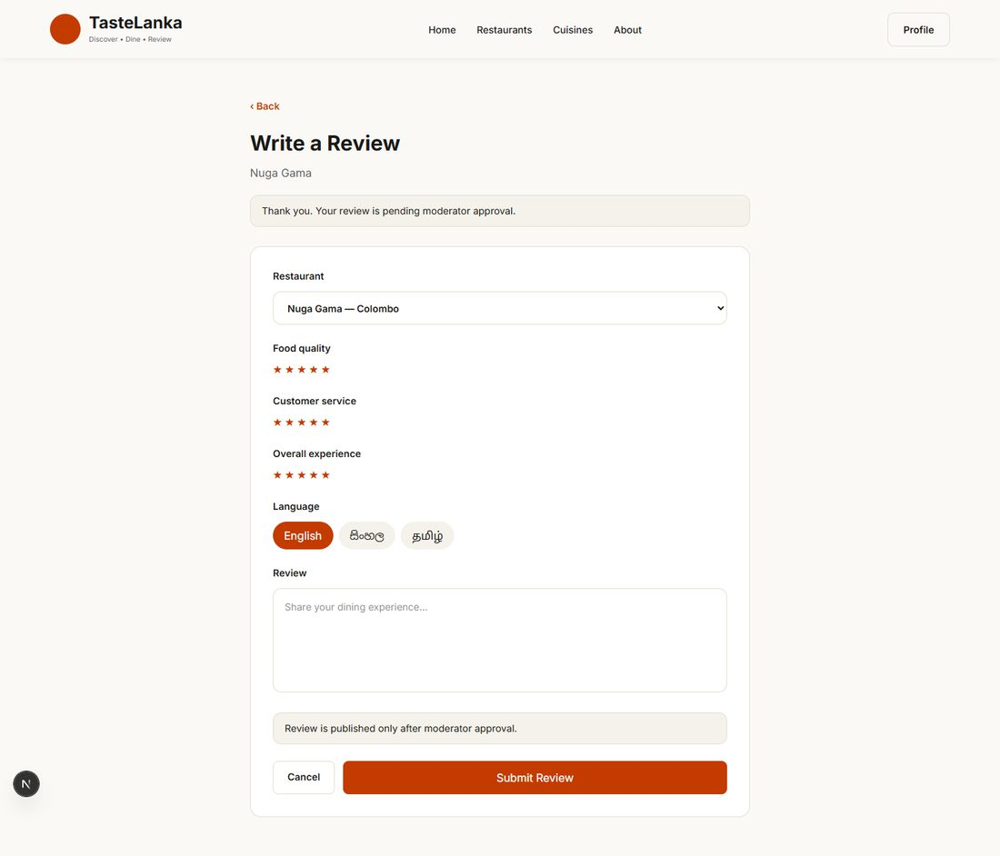

#### DEF-013 — restaurant list at 768 px

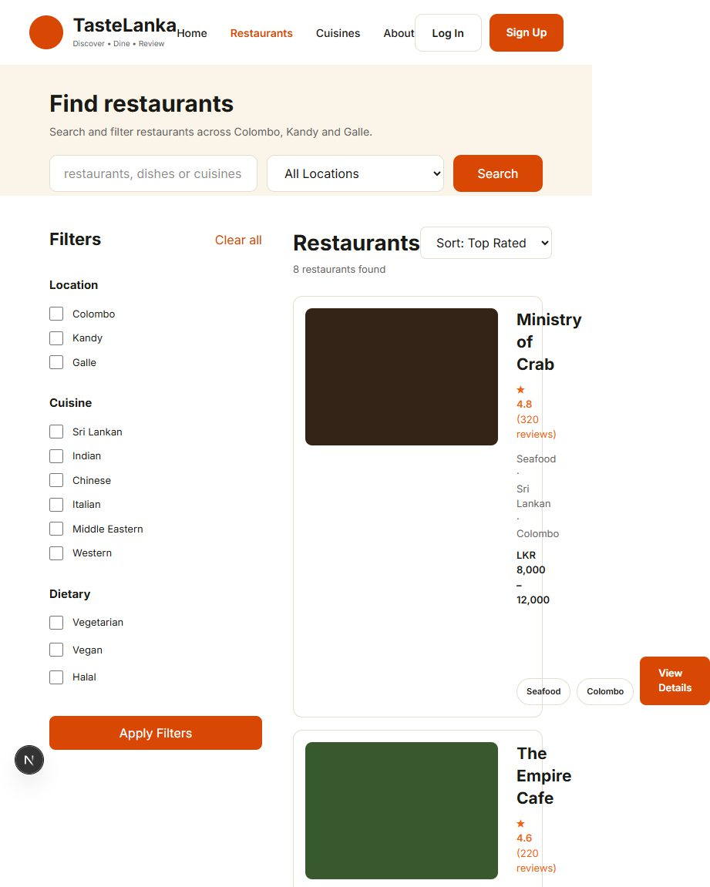

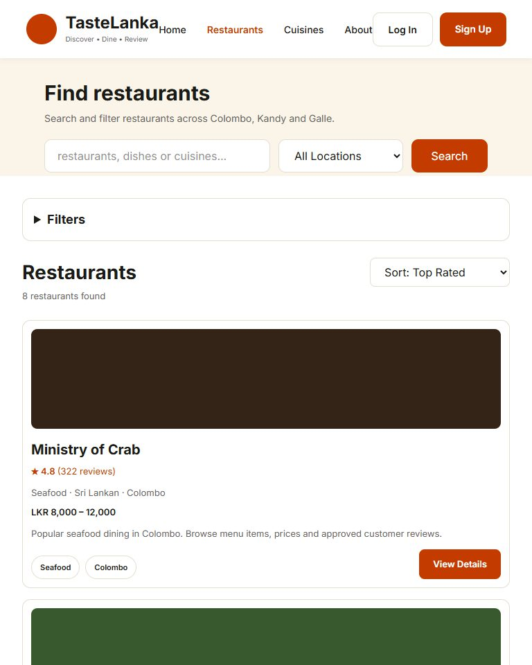

#### DEF-012 — filters on a phone


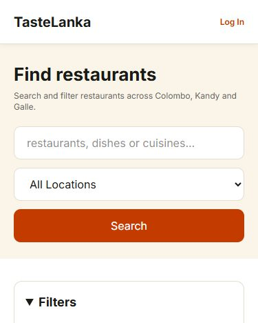

#### DEF-015 — saved state after reload


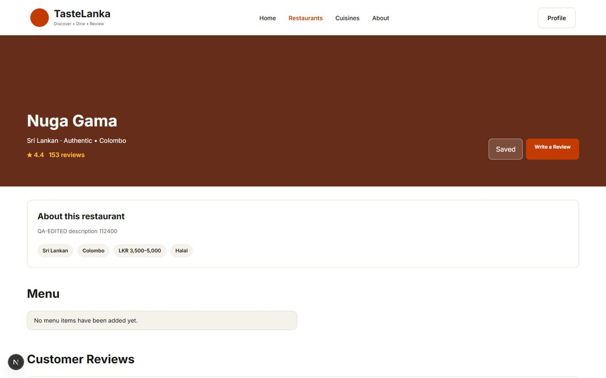

#### DEF-007 — deleting a reviewed restaurant


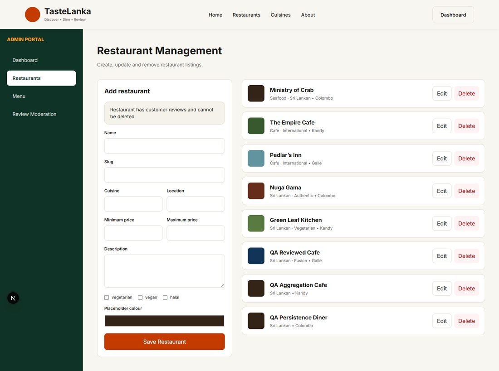

#### DEF-016 — home page Top Rated

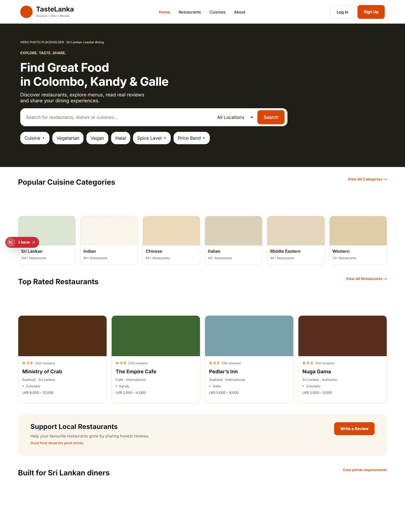

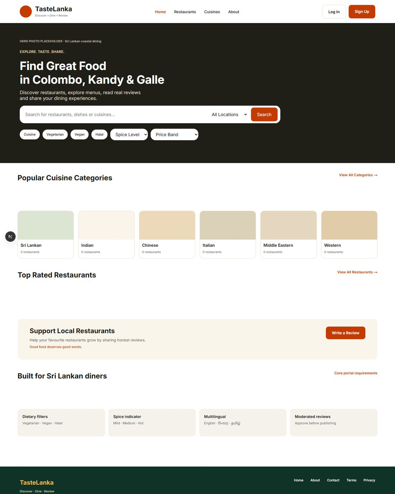

#### DEF-020 — moderation audit details

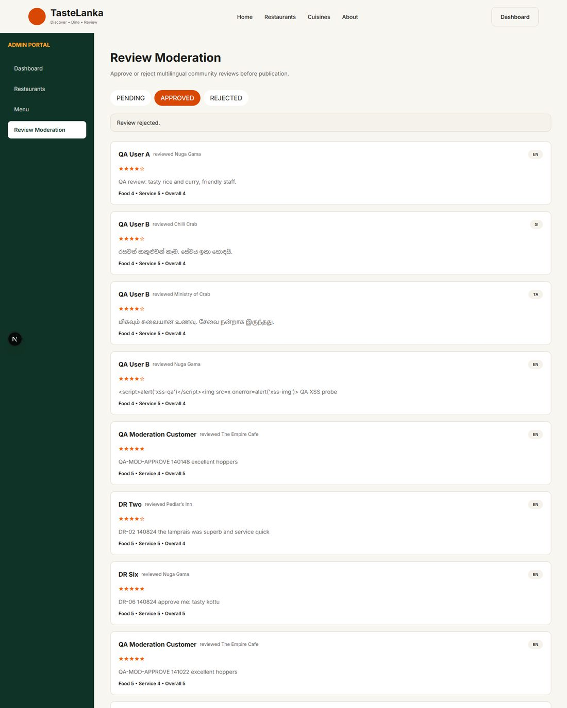

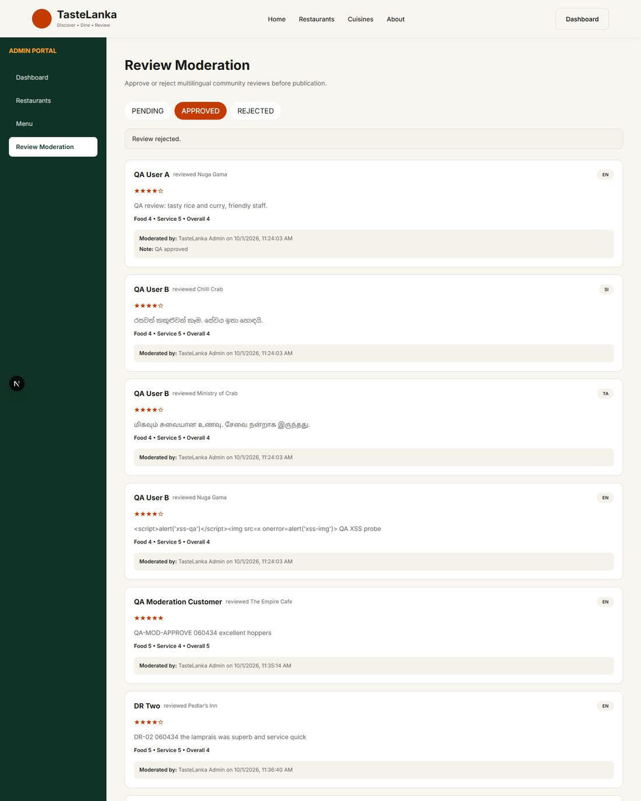

**C2-EVID-304 · BB-20a — axe-core results, cycle 2 (DEF-017, DEF-018)**

No WCAG 2.1 A/AA violations reported on the 10 scanned pages.

